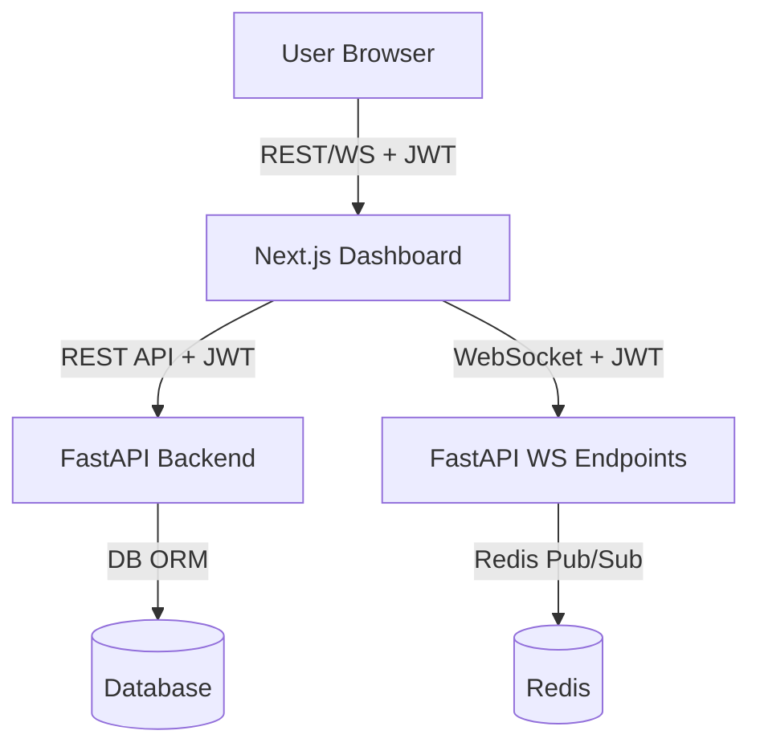

# Admin Dashboard Architecture Plan

## 1. Frontend Stack Recommendation

- **Framework:** Next.js (React-based, SSR/SSG/SPA support, best for performance, SEO, maintainability)
- **UI Library:** Material UI (MUI) – robust, accessible, customizable, widely adopted
- **Animation:** Framer Motion (seamless React integration, performant, declarative)
- **State Management:** Zustand (simple, scalable, minimal boilerplate) or Redux Toolkit (if global state is complex)
- **API Integration:** React Query (TanStack Query) for data fetching, caching, and mutation
- **Real-time:** Native WebSocket API (with JWT token in URL), optionally wrapped with a custom React hook

---

## 2. Modular Project Structure

```
/dashboard/
  ├── components/         # Reusable UI components (Button, Table, Modal, etc.)
  ├── features/           # Feature modules (users, products, orders, roles)
  │    └── users/
  │         ├── UserList.tsx
  │         ├── UserForm.tsx
  │         └── userApi.ts
  ├── hooks/              # Custom React hooks (useAuth, useWebSocket, etc.)
  ├── pages/              # Next.js pages (routes)
  │    ├── index.tsx
  │    ├── login.tsx
  │    └── dashboard/
  │         ├── index.tsx
  │         ├── users.tsx
  │         ├── products.tsx
  │         └── orders.tsx
  ├── providers/          # Context providers (AuthProvider, ThemeProvider)
  ├── services/           # API clients, WebSocket handlers
  ├── store/              # State management (if using Redux/Zustand)
  ├── styles/             # Global and component styles
  ├── utils/              # Utility functions (token helpers, validators)
  └── public/             # Static assets
```

---

## 3. Authentication & API Integration Patterns

- **JWT Auth Flow:**

  - Login page posts credentials to `/api/user/login`, receives JWT.
  - JWT stored in `httpOnly` cookie (preferred for security) or memory (if SSR not needed).
  - Authenticated requests: JWT sent via `Authorization: Bearer <token>`.
  - Use React Context (`AuthProvider`) to manage auth state and user info.
  - Protect dashboard routes with a custom `withAuth` HOC or middleware.

- **API Integration:**

  - Use React Query for all CRUD operations (users, products, orders, roles).
  - Define API clients in `/services/` or `/features/[entity]/[entity]Api.ts`.
  - Handle errors globally (e.g., 401 triggers logout).

- **WebSocket Integration:**
  - Use JWT as query param: `ws://host/api/v1/ws/products?token=JWT`
  - Custom `useWebSocket` hook for subscribing to real-time updates.
  - Dispatch updates to React Query cache or local state for instant UI refresh.

---

## 4. Real-Time Updates & Animated, Responsive UI

- **Real-Time:**

  - Listen to product/order updates via WebSocket endpoints.
  - On message, update local state or invalidate React Query cache for refetch.
  - Show toast/snackbar notifications for real-time events.

- **Animation:**

  - Use Framer Motion for page transitions, modals, and interactive elements.
  - Animate list/table updates (e.g., fade-in/out, slide, highlight on change).

- **Responsiveness:**
  - Use Material UI’s Grid and responsive utilities.
  - Test with Chrome DevTools and Lighthouse.

---

## 5. Best Practices

- **Performance:**

  - SSR/SSG for public pages, CSR for dashboard (Next.js hybrid).
  - Code splitting, lazy loading for heavy components.
  - Use React Query caching and pagination for large datasets.

- **Accessibility:**

  - Use semantic HTML and ARIA roles.
  - Ensure keyboard navigation and screen reader support.
  - Test with axe-core and Lighthouse.

- **Security:**

  - Store JWT in httpOnly cookie if possible.
  - CSRF protection for state-changing requests.
  - Validate all user input client-side and server-side.

- **Deployment:**
  - Deploy on Vercel (optimized for Next.js) or Docker (for custom infra).
  - Use environment variables for API URLs and secrets.
  - Enable HTTPS and set secure cookie flags.

---

## 6. Mermaid Diagram: High-Level Architecture


